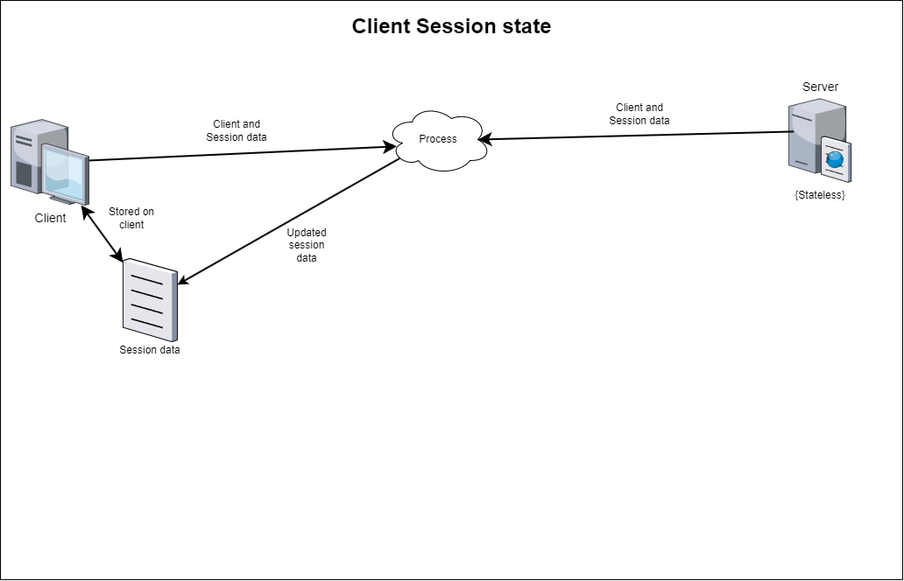

## Name

[Client Session pattern](https://dzone.com/articles/practical-php-patterns/practical-php-patterns-client)

## Intent

- Create stateless servers that removes the problem of clustering, as users can switch between servers seamlessly.
- Makes data more resilient in case of server fail-over.
- Works well with smaller data sizes.

## Explanation

Real-World Example

> You're looking to create a data management app allowing users to send requests to the server to 
> modify and make changes to data stored on their devices. These requests are small in size and the 
> data is individual to each user, negating the need for a large scale database implementation. 
> Using the client session pattern, you are able to handle multiple concurrent requests, load 
> balancing clients across different servers with ease due to servers remaining stateless. You also 
> remove the need to store session IDs on the server side due to clients providing all the 
> information that a server needs to perform their process.

In Plain words

> Instead of storing information about the current client and the information being accessed on the 
> server, it is maintained client side only. Client has to send session data with each request to 
> the server and has to send an updated state back to the client, which is stored on the clients 
> machine. The server doesn't have to store the client information.
> ([ref](https://dzone.com/articles/practical-php-patterns/practical-php-patterns-client))

**Programmatic Example**

Here is the sample code to describe the client-session pattern. In the below code we are first 
creating an instance of the Server. This server instance will then be used to get Session objects 
for two clients. As you can see from the code below the Session object can be used to store any 
relevant information that are required by the server to process the client request. These session 
objects will then be passed on with every Request to the server. The Request will have the Session 
object that stores the relevant client details along with the required data for processing the 
request. The session information in every request helps the server identify the client and process 
the request accordingly. 

```java
public class App {

  public static void main(String[] args) {
    var server = new Server("localhost", 8080);
    var session1 = server.getSession("Session1");
    var session2 = server.getSession("Session2");
    var request1 = new Request("Data1", session1);
    var request2 = new Request("Data2", session2);
    server.process(request1);
    server.process(request2);
  }
}

@Data
@AllArgsConstructor
public class Session {

  /**
   * Session id.
   */
  private String id;

  /**
   * Client name.
   */
  private String clientName;

}

@Data
@AllArgsConstructor
public class Request {

  private String data;

  private Session session;

}
```

## Architecture Diagram



## Applicability

Use the client state pattern when:

- Processing smaller amounts of data to prevent larger requests and response sizes.
- Remove the need for servers to save client states. Doing so also removes the need to store session IDs.
- Clustering is an issue and needs to be avoided. Stateless servers allow clients to be easily distributed across servers.
- Creates resilience from data losses due to server fails.

## Consequences

- The server is stateless. Any compute API will not store any data.
- Struggles to deal with large amounts of data. Creates longer send and receive times due to larger amounts of session data to manage.
- Security. All data is stored on the client's machine. This means that any vulnerabilities on the clients side can expose all data being sent and received by the server.


## Credits

- [Dzone - Practical PHP patterns](https://dzone.com/articles/practical-php-patterns/practical-php-patterns-client)
- [Client Session State Design Pattern - Ram N Java](https://www.youtube.com/watch?v=ycOSj9g41pc)
