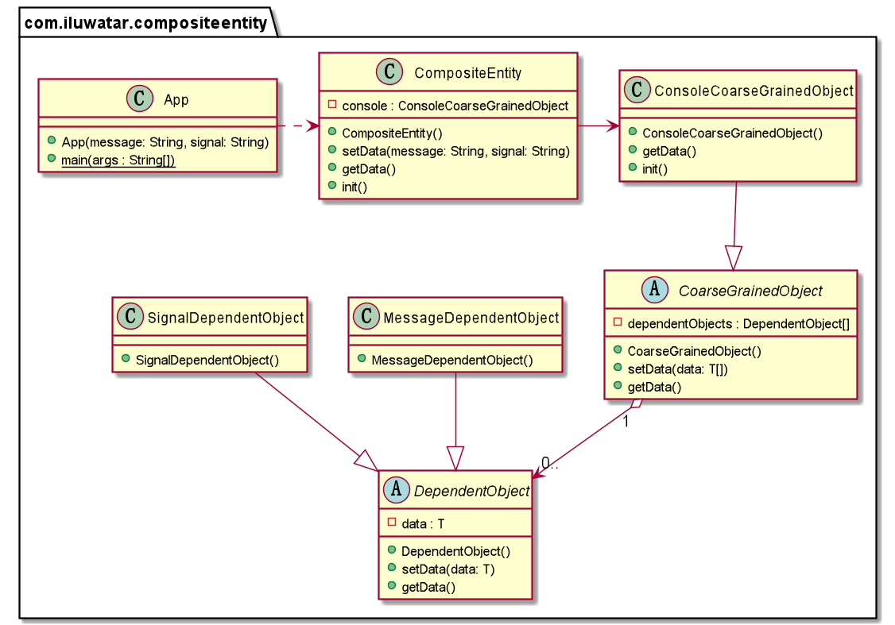

## Intent

It is used to model, represent, and manage a set of persistent objects that are interrelated, rather than representing them as individual fine-grained entities. 

## Explanation

Real world example

> For a console, there may be many interfaces that need to be managed and controlled. Using the composite entity pattern, dependent objects such as messages and signals can be combined together and controlled using a single object.

In plain words

> Composite entity pattern allows a set of related objects to be represented and managed by a unified object.

**Programmatic Example**

We need a generic solution for the problem. To achieve this, let's introduce a generic 
Composite Entity Pattern.

```java
public abstract class DependentObject<T> {

  T data;

  public void setData(T message) {
    this.data = message;
  }

  public T getData() {
    return data;
  }
}

public abstract class CoarseGrainedObject<T> {

  DependentObject<T>[] dependentObjects;

  public void setData(T... data) {
    IntStream.range(0, data.length).forEach(i -> dependentObjects[i].setData(data[i]));
  }

  public T[] getData() {
    return (T[]) Arrays.stream(dependentObjects).map(DependentObject::getData).toArray();
  }
}

```

The specialized composite entity `console` inherit from this base class as follows.

```java
public class MessageDependentObject extends DependentObject<String> {

}

public class SignalDependentObject extends DependentObject<String> {

}

public class ConsoleCoarseGrainedObject extends CoarseGrainedObject<String> {

  @Override
  public String[] getData() {
    super.getData();
    return new String[]{
        dependentObjects[0].getData(), dependentObjects[1].getData()
    };
  }

  public void init() {
    dependentObjects = new DependentObject[]{
        new MessageDependentObject(), new SignalDependentObject()};
  }
}

public class CompositeEntity {

  private final ConsoleCoarseGrainedObject console = new ConsoleCoarseGrainedObject();

  public void setData(String message, String signal) {
    console.setData(message, signal);
  }

  public String[] getData() {
    return console.getData();
  }
}
```

Now managing the assignment of message and signal objects with the composite entity `console`.

```java
var console = new CompositeEntity();
console.init();
console.setData("No Danger", "Green Light");
Arrays.stream(console.getData()).forEach(LOGGER::info);
console.setData("Danger", "Red Light");
Arrays.stream(console.getData()).forEach(LOGGER::info);
```

## Class diagram



## Applicability

Use the Composite Entity Pattern in the following situation:

* You want to manage multiple dependency objects through one object to adjust the degree of granularity between objects. At the same time, the lifetime of dependency objects depends on a coarse-grained object.
## Credits

* [Composite Entity Pattern in wikipedia](https://en.wikipedia.org/wiki/Composite_entity_pattern)
