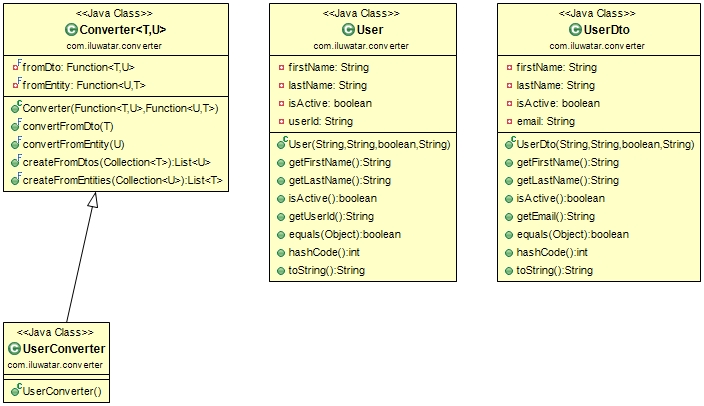

## Intent

The purpose of the Converter pattern is to provide a generic, common way of bidirectional
conversion between corresponding types, allowing a clean implementation in which the types do not
need to be aware of each other. Moreover, the Converter pattern introduces bidirectional collection
mapping, reducing a boilerplate code to minimum.

## Explanation

Real world example

> In real world applications it is often the case that database layer consists of entities that need 
> to be mapped into DTOs for use on the business logic layer. Similar mapping is done for 
> potentially huge amount of classes and we need a generic way to achieve this.

In plain words

> Converter pattern makes it easy to map instances of one class into instances of another class.

**Programmatic Example**

We need a generic solution for the mapping problem. To achieve this, let's introduce a generic 
converter.

```java
public class Converter<T, U> {

  private final Function<T, U> fromDto;
  private final Function<U, T> fromEntity;

  public Converter(final Function<T, U> fromDto, final Function<U, T> fromEntity) {
    this.fromDto = fromDto;
    this.fromEntity = fromEntity;
  }

  public final U convertFromDto(final T dto) {
    return fromDto.apply(dto);
  }

  public final T convertFromEntity(final U entity) {
    return fromEntity.apply(entity);
  }

  public final List<U> createFromDtos(final Collection<T> dtos) {
    return dtos.stream().map(this::convertFromDto).collect(Collectors.toList());
  }

  public final List<T> createFromEntities(final Collection<U> entities) {
    return entities.stream().map(this::convertFromEntity).collect(Collectors.toList());
  }
}
```

The specialized converters inherit from this base class as follows.

```java
public class UserConverter extends Converter<UserDto, User> {

  public UserConverter() {
    super(UserConverter::convertToEntity, UserConverter::convertToDto);
  }

  private static UserDto convertToDto(User user) {
    return new UserDto(user.getFirstName(), user.getLastName(), user.isActive(), user.getUserId());
  }

  private static User convertToEntity(UserDto dto) {
    return new User(dto.getFirstName(), dto.getLastName(), dto.isActive(), dto.getEmail());
  }

}
```

Now mapping between `User` and `UserDto` becomes trivial.

```java
var userConverter = new UserConverter();
var dtoUser = new UserDto("John", "Doe", true, "whatever[at]wherever.com");
var user = userConverter.convertFromDto(dtoUser);
```

## Class diagram



## Applicability

Use the Converter Pattern in the following situations:

* When you have types that logically correspond with each other and you need to convert entities 
between them.
* When you want to provide different ways of types conversions depending on the context.
* Whenever you introduce a DTO (Data transfer object), you will probably need to convert it into the 
domain equivalence.

## Credits

* [Converter Pattern in Java 8](http://www.xsolve.pl/blog/converter-pattern-in-java-8/)
