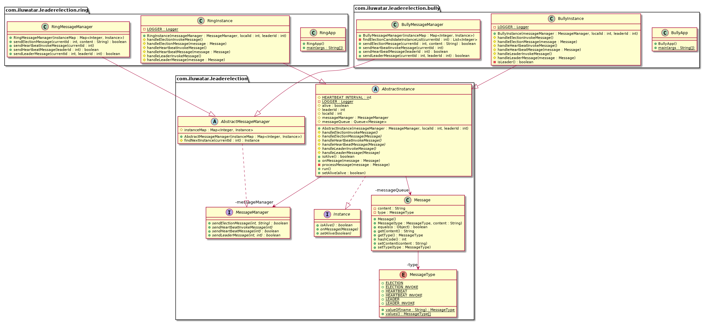

## Intent
Leader Election pattern is commonly used in cloud system design. It can help to ensure that task instances select the leader instance correctly and do not conflict with each other, cause contention for shared resources, or inadvertently interfere with the work that other task instances are performing.

## Class diagram

## Applicability
Use this pattern when

* the tasks in a distributed application, such as a cloud-hosted solution, require careful coordination and there is no natural leader.

Do not use this pattern when

* there is a natural leader or dedicated process that can always act as the leader. For example, it may be possible to implement a singleton process that coordinates the task instances. If this process fails or becomes unhealthy, the system can shut it down and restart it.
* the coordination between tasks can be easily achieved by using a more lightweight mechanism. For example, if several task instances simply require coordinated access to a shared resource, a preferable solution might be to use optimistic or pessimistic locking to control access to that resource.

## Real world examples

* [Raft Leader Election](https://github.com/ronenhamias/raft-leader-election)

## Credits

* [Leader Election pattern](https://docs.microsoft.com/en-us/azure/architecture/patterns/leader-election)
