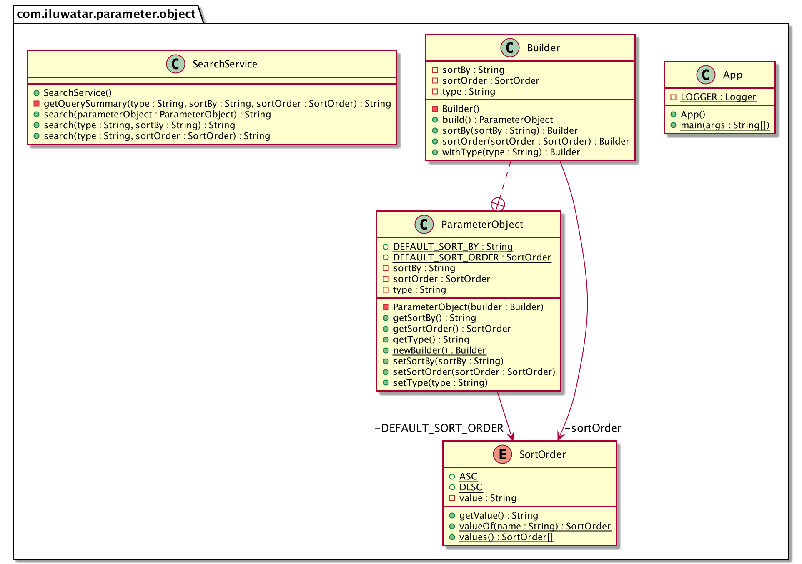

## Intent

The syntax of Java language doesn’t allow you to declare a method with a predefined value
for a parameter. Probably the best option to achieve default method parameters in Java is
by using the method overloading. Method overloading allows you to declare several methods
with the same name but with a different number of parameters. But the main problem with
method overloading as a solution for default parameter values reveals itself when a method
accepts multiple parameters. Creating an overloaded method for each possible combination of
parameters might be cumbersome. To deal with this issue, the Parameter Object pattern is used.

## Explanation

The Parameter Object is simply a wrapper object for all parameters of a method.
It is nothing more than just a regular POJO. The advantage of the Parameter Object over a
regular method parameter list is the fact that class fields can have default values.
Once the wrapper class is created for the method parameter list, a corresponding builder class
is also created. Usually it's an inner static class. The final step is to use the builder
to construct a new parameter object. For those parameters that are skipped,
their default values are going to be used.


**Programmatic Example**

Here's the simple `SearchService` class where Method Overloading is used to default values here. To use method overloading, either the number of arguments or argument type has to be different.

```java
public class SearchService {
  //Method Overloading example. SortOrder is defaulted in this method
  public String search(String type, String sortBy) {
    return getQuerySummary(type, sortBy, SortOrder.DESC);
  }

  /* Method Overloading example. SortBy is defaulted in this method. Note that the type has to be 
  different here to overload the method */
  public String search(String type, SortOrder sortOrder) {
    return getQuerySummary(type, "price", sortOrder);
  }

  private String getQuerySummary(String type, String sortBy, SortOrder sortOrder) {
    return "Requesting shoes of type \"" + type + "\" sorted by \"" + sortBy + "\" in \""
        + sortOrder.getValue() + "ending\" order...";
  }
}

```

Next we present the `SearchService` with `ParameterObject` created with Builder pattern.

```java
public class SearchService {

  /* Parameter Object example. Default values are abstracted into the Parameter Object 
  at the time of Object creation */
  public String search(ParameterObject parameterObject) {
    return getQuerySummary(parameterObject.getType(), parameterObject.getSortBy(),
        parameterObject.getSortOrder());
  }
  
  private String getQuerySummary(String type, String sortBy, SortOrder sortOrder) {
    return "Requesting shoes of type \"" + type + "\" sorted by \"" + sortBy + "\" in \""
        + sortOrder.getValue() + "ending\" order...";
  }
}

public class ParameterObject {
  public static final String DEFAULT_SORT_BY = "price";
  public static final SortOrder DEFAULT_SORT_ORDER = SortOrder.ASC;

  private String type;
  private String sortBy = DEFAULT_SORT_BY;
  private SortOrder sortOrder = DEFAULT_SORT_ORDER;

  private ParameterObject(Builder builder) {
    type = builder.type;
    sortBy = builder.sortBy != null && !builder.sortBy.isBlank() ? builder.sortBy : sortBy;
    sortOrder = builder.sortOrder != null ? builder.sortOrder : sortOrder;
  }

  public static Builder newBuilder() {
    return new Builder();
  }

  //Getters and Setters...

  public static final class Builder {

    private String type;
    private String sortBy;
    private SortOrder sortOrder;

    private Builder() {
    }

    public Builder withType(String type) {
      this.type = type;
      return this;
    }

    public Builder sortBy(String sortBy) {
      this.sortBy = sortBy;
      return this;
    }

    public Builder sortOrder(SortOrder sortOrder) {
      this.sortOrder = sortOrder;
      return this;
    }

    public ParameterObject build() {
      return new ParameterObject(this);
    }
  }
}


```

## Class diagram



## Applicability

This pattern shows us the way to have default parameters for a method in Java as the language doesn't default parameters feature out of the box. 

## Credits

- [Does Java have default parameters?](http://dolszewski.com/java/java-default-parameters)
