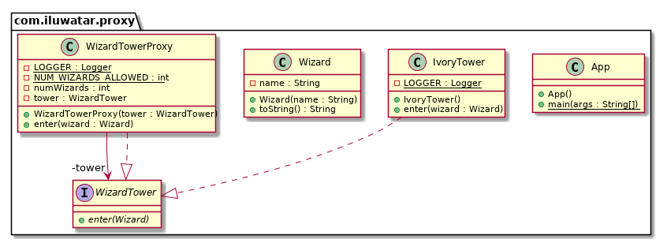

## Also known as

Surrogate

## Intent

Provide a surrogate or placeholder for another object to control access to it.

## Explanation

Real-world example

> Imagine a tower where the local wizards go to study their spells. The ivory tower can only be 
> accessed through a proxy which ensures that only the first three wizards can enter. Here the proxy 
> represents the functionality of the tower and adds access control to it.

In plain words

> Using the proxy pattern, a class represents the functionality of another class.

Wikipedia says

> A proxy, in its most general form, is a class functioning as an interface to something else. 
> A proxy is a wrapper or agent object that is being called by the client to access the real serving 
> object behind the scenes. Use of the proxy can simply be forwarding to the real object, or can 
> provide additional logic. In the proxy extra functionality can be provided, for example caching 
> when operations on the real object are resource intensive, or checking preconditions before 
> operations on the real object are invoked.

**Programmatic Example**

Taking our wizard tower example from above. Firstly we have the `WizardTower` interface and the 
`IvoryTower` class.

```java
public interface WizardTower {

  void enter(Wizard wizard);
}

@Slf4j
public class IvoryTower implements WizardTower {

  public void enter(Wizard wizard) {
    LOGGER.info("{} enters the tower.", wizard);
  }

}
```

Then a simple `Wizard` class.

```java
public class Wizard {

  private final String name;

  public Wizard(String name) {
    this.name = name;
  }

  @Override
  public String toString() {
    return name;
  }
}
```

Then we have the `WizardTowerProxy` to add access control to `WizardTower`.

```java
@Slf4j
public class WizardTowerProxy implements WizardTower {

  private static final int NUM_WIZARDS_ALLOWED = 3;

  private int numWizards;

  private final WizardTower tower;

  public WizardTowerProxy(WizardTower tower) {
    this.tower = tower;
  }

  @Override
  public void enter(Wizard wizard) {
    if (numWizards < NUM_WIZARDS_ALLOWED) {
      tower.enter(wizard);
      numWizards++;
    } else {
      LOGGER.info("{} is not allowed to enter!", wizard);
    }
  }
}
```

And here is the tower entering scenario.

```java
var proxy = new WizardTowerProxy(new IvoryTower());
proxy.enter(new Wizard("Red wizard"));
proxy.enter(new Wizard("White wizard"));
proxy.enter(new Wizard("Black wizard"));
proxy.enter(new Wizard("Green wizard"));
proxy.enter(new Wizard("Brown wizard"));
```

Program output:

```
Red wizard enters the tower.
White wizard enters the tower.
Black wizard enters the tower.
Green wizard is not allowed to enter!
Brown wizard is not allowed to enter!
```

## Class diagram



## Applicability

Proxy is applicable whenever there is a need for a more versatile or sophisticated reference to an 
object than a simple pointer. Here are several common situations in which the Proxy pattern is 
applicable.

* Remote proxy provides a local representative for an object in a different address space.
* Virtual proxy creates expensive objects on demand.
* Protection proxy controls access to the original object. Protection proxies are useful when 
objects should have different access rights.

Typically, the proxy pattern is used to

* Control access to another object
* Lazy initialization
* Implement logging
* Facilitate network connection
* Count references to an object

## Tutorials

* [Controlling Access With Proxy Pattern](http://java-design-patterns.com/blog/controlling-access-with-proxy-pattern/)

## Known uses

* [java.lang.reflect.Proxy](http://docs.oracle.com/javase/8/docs/api/java/lang/reflect/Proxy.html)
* [Apache Commons Proxy](https://commons.apache.org/proper/commons-proxy/)
* Mocking frameworks [Mockito](https://site.mockito.org/), 
[Powermock](https://powermock.github.io/), [EasyMock](https://easymock.org/)

## Related patterns

* [Ambassador](https://java-design-patterns.com/patterns/ambassador/)

## Credits

* [Design Patterns: Elements of Reusable Object-Oriented Software](https://www.amazon.com/gp/product/0201633612/ref=as_li_tl?ie=UTF8&camp=1789&creative=9325&creativeASIN=0201633612&linkCode=as2&tag=javadesignpat-20&linkId=675d49790ce11db99d90bde47f1aeb59)
* [Head First Design Patterns: A Brain-Friendly Guide](https://www.amazon.com/gp/product/0596007124/ref=as_li_tl?ie=UTF8&camp=1789&creative=9325&creativeASIN=0596007124&linkCode=as2&tag=javadesignpat-20&linkId=6b8b6eea86021af6c8e3cd3fc382cb5b)
