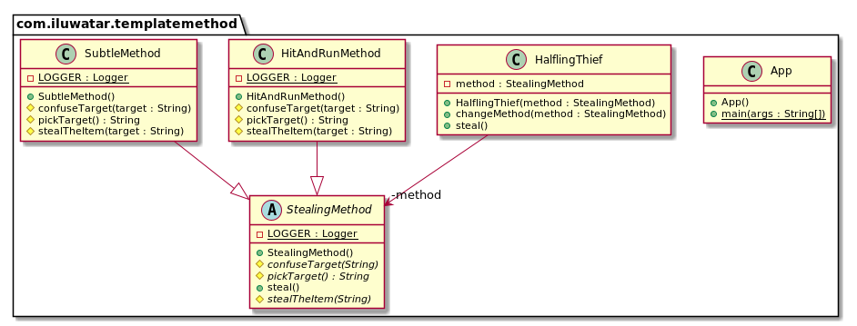

## Intent

Define the skeleton of an algorithm in an operation, deferring some steps to subclasses. Template 
Method lets subclasses redefine certain steps of an algorithm without changing the algorithm's 
structure.

## Explanation

Real-world example

> The general steps in stealing an item are the same. First, you pick the target, next you confuse 
> him somehow and finally, you steal the item. However, there are many ways to implement these 
> steps.   

In plain words

> Template Method pattern outlines the general steps in the parent class and lets the concrete child 
> implementations define the details. 

Wikipedia says

> In object-oriented programming, the template method is one of the behavioral design patterns 
> identified by Gamma et al. in the book Design Patterns. The template method is a method in a 
> superclass, usually an abstract superclass, and defines the skeleton of an operation in terms of 
> a number of high-level steps. These steps are themselves implemented by additional helper methods 
> in the same class as the template method.

**Programmatic Example**

Let's first introduce the template method class along with its concrete implementations.
To make sure that subclasses don’t override the template method, the template method (in our case
method `steal`) should be declared `final`, otherwise the skeleton defined in the base class could
be overridden in subclasses.


```java
@Slf4j
public abstract class StealingMethod {

  protected abstract String pickTarget();

  protected abstract void confuseTarget(String target);

  protected abstract void stealTheItem(String target);

  public final void steal() {
    var target = pickTarget();
    LOGGER.info("The target has been chosen as {}.", target);
    confuseTarget(target);
    stealTheItem(target);
  }
}

@Slf4j
public class SubtleMethod extends StealingMethod {

  @Override
  protected String pickTarget() {
    return "shop keeper";
  }

  @Override
  protected void confuseTarget(String target) {
    LOGGER.info("Approach the {} with tears running and hug him!", target);
  }

  @Override
  protected void stealTheItem(String target) {
    LOGGER.info("While in close contact grab the {}'s wallet.", target);
  }
}

@Slf4j
public class HitAndRunMethod extends StealingMethod {

  @Override
  protected String pickTarget() {
    return "old goblin woman";
  }

  @Override
  protected void confuseTarget(String target) {
    LOGGER.info("Approach the {} from behind.", target);
  }

  @Override
  protected void stealTheItem(String target) {
    LOGGER.info("Grab the handbag and run away fast!");
  }
}
```

Here's the halfling thief class containing the template method.

```java
public class HalflingThief {

  private StealingMethod method;

  public HalflingThief(StealingMethod method) {
    this.method = method;
  }

  public void steal() {
    method.steal();
  }

  public void changeMethod(StealingMethod method) {
    this.method = method;
  }
}
```

And finally, we show how the halfling thief utilizes the different stealing methods.

```java
    var thief = new HalflingThief(new HitAndRunMethod());
    thief.steal();
    thief.changeMethod(new SubtleMethod());
    thief.steal();
```

## Class diagram



## Applicability

The Template Method pattern should be used

* To implement the invariant parts of an algorithm once and leave it up to subclasses to implement the behavior that can vary
* When common behavior among subclasses should be factored and localized in a common class to avoid code duplication. This is a good example of "refactoring to generalize" as described by Opdyke and Johnson. You first identify the differences in the existing code and then separate the differences into new operations. Finally, you replace the differing code with a template method that calls one of these new operations
* To control subclasses extensions. You can define a template method that calls "hook" operations at specific points, thereby permitting extensions only at those points

## Tutorials

* [Template-method Pattern Tutorial](https://www.journaldev.com/1763/template-method-design-pattern-in-java)

## Known uses

* [javax.servlet.GenericServlet.init](https://jakarta.ee/specifications/servlet/4.0/apidocs/javax/servlet/GenericServlet.html#init--): 
Method `GenericServlet.init(ServletConfig config)` calls the parameterless method `GenericServlet.init()` which is intended to be overridden in subclasses.
Method `GenericServlet.init(ServletConfig config)` is the template method in this example.

## Credits

* [Design Patterns: Elements of Reusable Object-Oriented Software](https://www.amazon.com/gp/product/0201633612/ref=as_li_tl?ie=UTF8&camp=1789&creative=9325&creativeASIN=0201633612&linkCode=as2&tag=javadesignpat-20&linkId=675d49790ce11db99d90bde47f1aeb59)
* [Head First Design Patterns: A Brain-Friendly Guide](https://www.amazon.com/gp/product/0596007124/ref=as_li_tl?ie=UTF8&camp=1789&creative=9325&creativeASIN=0596007124&linkCode=as2&tag=javadesignpat-20&linkId=6b8b6eea86021af6c8e3cd3fc382cb5b)
* [Refactoring to Patterns](https://www.amazon.com/gp/product/0321213351/ref=as_li_tl?ie=UTF8&camp=1789&creative=9325&creativeASIN=0321213351&linkCode=as2&tag=javadesignpat-20&linkId=2a76fcb387234bc71b1c61150b3cc3a7)
