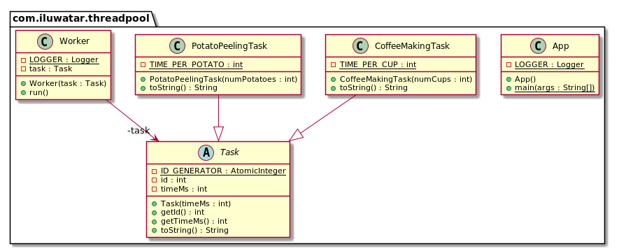

## Intent

It is often the case that tasks to be executed are short-lived and the number of tasks is large. 
Creating a new thread for each task would make the system spend more time creating and destroying 
the threads than executing the actual tasks. Thread Pool solves this problem by reusing existing 
threads and eliminating the latency of creating new threads.

## Explanation

Real-world example

> We have a large number of relatively short tasks at hand. We need to peel huge amounts of potatoes 
> and serve a mighty amount of coffee cups. Creating a new thread for each task would be a waste so 
> we establish a thread pool.       

In plain words

> Thread Pool is a concurrency pattern where threads are allocated once and reused between tasks. 

Wikipedia says

> In computer programming, a thread pool is a software design pattern for achieving concurrency of 
> execution in a computer program. Often also called a replicated workers or worker-crew model, 
> a thread pool maintains multiple threads waiting for tasks to be allocated for concurrent 
> execution by the supervising program. By maintaining a pool of threads, the model increases 
> performance and avoids latency in execution due to frequent creation and destruction of threads 
> for short-lived tasks. The number of available threads is tuned to the computing resources 
> available to the program, such as a parallel task queue after completion of execution.

**Programmatic Example**

Let's first look at our task hierarchy. We have a base class and then concrete `CoffeeMakingTask` 
and `PotatoPeelingTask`.

```java
public abstract class Task {

  private static final AtomicInteger ID_GENERATOR = new AtomicInteger();

  private final int id;
  private final int timeMs;

  public Task(final int timeMs) {
    this.id = ID_GENERATOR.incrementAndGet();
    this.timeMs = timeMs;
  }

  public int getId() {
    return id;
  }

  public int getTimeMs() {
    return timeMs;
  }

  @Override
  public String toString() {
    return String.format("id=%d timeMs=%d", id, timeMs);
  }
}

public class CoffeeMakingTask extends Task {

  private static final int TIME_PER_CUP = 100;

  public CoffeeMakingTask(int numCups) {
    super(numCups * TIME_PER_CUP);
  }

  @Override
  public String toString() {
    return String.format("%s %s", this.getClass().getSimpleName(), super.toString());
  }
}

public class PotatoPeelingTask extends Task {

  private static final int TIME_PER_POTATO = 200;

  public PotatoPeelingTask(int numPotatoes) {
    super(numPotatoes * TIME_PER_POTATO);
  }

  @Override
  public String toString() {
    return String.format("%s %s", this.getClass().getSimpleName(), super.toString());
  }
}
```

Next, we present a runnable `Worker` class that the thread pool will utilize to handle all the potato 
peeling and coffee making.

```java
@Slf4j
public class Worker implements Runnable {

  private final Task task;

  public Worker(final Task task) {
    this.task = task;
  }

  @Override
  public void run() {
    LOGGER.info("{} processing {}", Thread.currentThread().getName(), task.toString());
    try {
      Thread.sleep(task.getTimeMs());
    } catch (InterruptedException e) {
      e.printStackTrace();
    }
  }
}
```

Now we are ready to show the full example in action.

```java
    LOGGER.info("Program started");

    // Create a list of tasks to be executed
    var tasks = List.of(
        new PotatoPeelingTask(3),
        new PotatoPeelingTask(6),
        new CoffeeMakingTask(2),
        new CoffeeMakingTask(6),
        new PotatoPeelingTask(4),
        new CoffeeMakingTask(2),
        new PotatoPeelingTask(4),
        new CoffeeMakingTask(9),
        new PotatoPeelingTask(3),
        new CoffeeMakingTask(2),
        new PotatoPeelingTask(4),
        new CoffeeMakingTask(2),
        new CoffeeMakingTask(7),
        new PotatoPeelingTask(4),
        new PotatoPeelingTask(5));

    // Creates a thread pool that reuses a fixed number of threads operating off a shared
    // unbounded queue. At any point, at most nThreads threads will be active processing
    // tasks. If additional tasks are submitted when all threads are active, they will wait
    // in the queue until a thread is available.
    var executor = Executors.newFixedThreadPool(3);

    // Allocate new worker for each task
    // The worker is executed when a thread becomes
    // available in the thread pool
    tasks.stream().map(Worker::new).forEach(executor::execute);
    // All tasks were executed, now shutdown
    executor.shutdown();
    while (!executor.isTerminated()) {
      Thread.yield();
    }
    LOGGER.info("Program finished");
```

## Class diagram



## Applicability

Use the Thread Pool pattern when

* You have a large number of short-lived tasks to be executed in parallel

## Credits

* [Effective Java](https://www.amazon.com/gp/product/0134685997/ref=as_li_qf_asin_il_tl?ie=UTF8&tag=javadesignpat-20&creative=9325&linkCode=as2&creativeASIN=0134685997&linkId=e1b9ddd5e669591642c4f30d40cd9f6b)
* [Java Concurrency in Practice](https://www.amazon.com/gp/product/0321349601/ref=as_li_qf_asin_il_tl?ie=UTF8&tag=javadesignpat-20&creative=9325&linkCode=as2&creativeASIN=0321349601&linkId=fbedb3bad3c6cbead5afa56eea39ed59)
